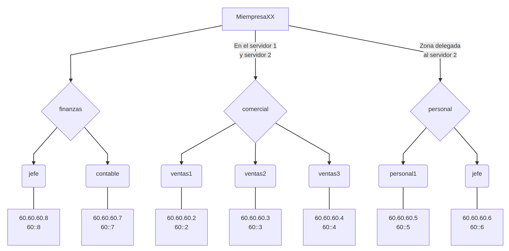

# Práctica DNS con Bind9 en Docker

En esta práctica se crea el siguiente árbol DNS:



Se pueden comprobar los nombres desde el contenedor `acl_cliente` con comandos como los siguientes:

- `nslookup ftp.finanzas.miempresa06. dns1`

- `nslookup jefe.personal.miempresa06. dns2`

### Contenedores

- DNS 1: [acharluk/dns1:final](https://hub.docker.com/r/acharluk/dns1)
- DNS 2: [acharluk/dns2:final](https://hub.docker.com/r/acharluk/dns2)
- Cliente: [acharluk/cliente:final](https://hub.docker.com/r/acharluk/cliente)

### Docker Compose

Con el archivo del siguiente enlace se puede ejecutar el comando `docker-compose up -d` y de forma automática se crean los tres contenedores y podemos conectarnos al cliente haciendo `docker attach acl_cliente`.

> Nota: El archivo debe llamarse `docker-compose.yml` para que el comando anterior funcione correctamente.

Enlace: [GitHub ACharLuk: docker-compose.yml](https://github.com/acharluk/ASIR/blob/master/2o/SRI/DockerDNS/)

Para mayor comodidad, he creado también un archivo `ejecutar.sh`, de forma que si se descargan ambos archivos, se le da permiso de ejecución al fichero con el comando `chmod +x ejecutar.sh` y se ejecuta el comando `./ejecutar.sh`, se creará la red, los tres contenedores y se conectará directamente con el cliente para comenzar a realizar consultas.

Aquí se puede ver un ejemplo de funcionamiento:

```java
acharluk@Nashira:~/Repos/ASIR/2o/SRI/DockerDNS$ ll
total 12
drwxr-xr-x 2 acharluk acharluk 4096 nov 13 12:31 ./
drwxr-xr-x 3 acharluk acharluk 4096 nov 13 12:30 ../
-rw-r--r-- 1 acharluk acharluk  859 nov 13 12:31 docker-compose.yml

acharluk@Nashira:~/Repos/ASIR/2o/SRI/DockerDNS$ docker-compose up -d
acl_dns1 is up-to-date
acl_dns2 is up-to-date
Starting acl_cliente ... done

acharluk@Nashira:~/Repos/ASIR/2o/SRI/DockerDNS$ docker ps
CONTAINER ID        IMAGE                     COMMAND             CREATED             
7b3e4b5d0d4c        acharluk/cliente:latest   "/bin/bash"         6 minutes ago       
5459795c3e2b        acharluk/dns1:latest      "/entrypoint.sh"    6 minutes ago    
00c43aaae8dd        acharluk/dns2:latest      "/entrypoint.sh"    6 minutes ago    

acharluk@Nashira:~/Repos/ASIR/2o/SRI/DockerDNS$ docker attach acl_cliente
root@7b3e4b5d0d4c:/# nslookup jefe.finanzas.miempresa06. dns1
Server:		dns1
Address:	172.97.0.2#53

Name:	jefe.finanzas.miempresa06
Address: 60.60.60.8
Name:	jefe.finanzas.miempresa06
Address: 60::8

root@7b3e4b5d0d4c:/# 

```
